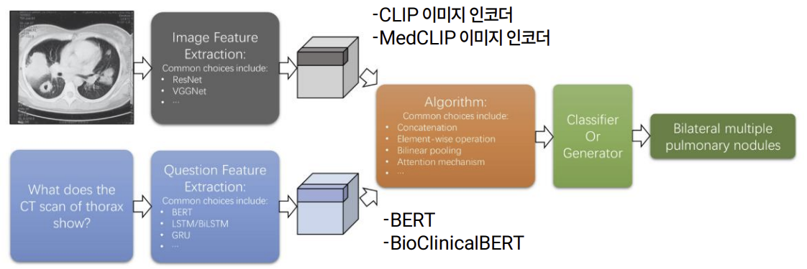
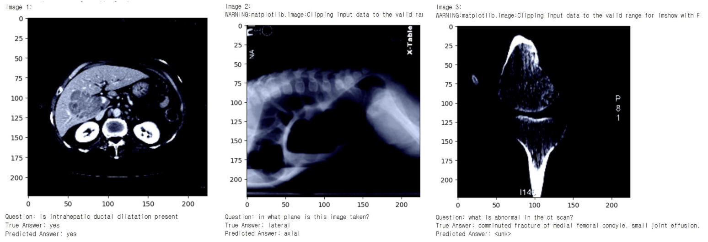

# MedicalVQAMedical Visual Question Answering (VQA)
## Overview
This project explores the **performance of various pretrained models** in the Medical Visual Question Answering (VQA) task. We compare different **image encoders** and **question encoders** to evaluate their impact on system performance, using several widely adopted medical datasets.

## Task
The goal is to build a VQA system that generates answers based on medical images and associated questions. We experiment with the following configurations:
**1. CLIP Image Encoder + BERT Question Encoder**
**2. CLIP Image Encoder + BioClinicalBERT Question Encoder**
**3. MedCLIP Image Encoder + BERT Question Encoder**
**4. MedCLIP Image Encoder + BioClinicalBERT Question Encoder**

## Framework

The system follows this workflow:
1. **Question Embedding Generation**: Encodes the text question using the question encoder.
2. **Image Embedding Generation**: Encodes the medical image using the image encoder.
3. **Attention Mechanism**: Combines the question and image embeddings.
4. **MLP Network**: The combined embeddings are passed through an MLP network to generate the final output.

## Datasets
We use three widely known datasets in medical VQA:
1. **VQA-Med-2019**
- Images: 3K
- QA Pairs: 6K
2. **VQA-RAD**
- Images: 315
- QA Pairs: 3K
3. **SLAKE**
- Images: 642
- QA Pairs: 7K

## Results

_Figure 1: Example of result output._

_Figure 2: Performance graph showcasing model comparison._

1. **Validation Accuracy Trends**
  - **CLIP + BERT** and **CLIP + BioBERT** showed slightly better performance in validation loss trends than the other combinations.

2. **Top Performing Model**
  - **CLIP + BioBERT** achieved the best performance with **60% accuracy**.
  - Increasing the number of epochs could potentially improve performance further.

3. **Comparison of Other Models**
  - **MedCLIP + BERT** and **CLIP + BERT** performed similarly, with around **50% accuracy**.
  - **MedCLIP + BioBERT** performed slightly worse compared to other combinations.

4. **Answer Distribution Analysis**
  - The model training focused on the top **1,000 most frequent answers** from a pool of **2,044 unique answers**.
  
## Conclusion
- **Pretrained models** play a crucial role in improving the performance of Medical VQA systems.
- Selecting **compatible encoders** for both the image and question components is essential to achieving good performance.
- Using **domain-specific models** (e.g., BioBERT) can enhance results, but mismatched embeddings from different domains can hinder performance.
